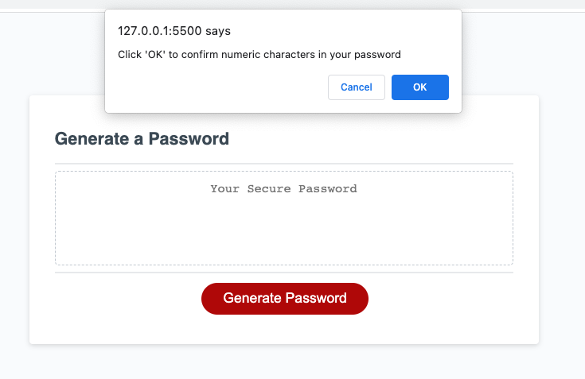

# Password Generator

## Description

This week's project was to create a random password generator that would take user input for character length, within certain parameters, and character type, also with certain parameters. The HTML and CSS code were provided so I had to create the JavaScript code to perform the generation/creation of the password as well as take user input via confirm prompts as criteria for the password they want.

I learned a lot more about functions this project by declaring and calling them throughout the code. I also learned more about using arrays and objects for this project, since they were used in the collection of data and also passing the data to be used in a function. 

## Usage

To access this password generator, you can run it locally by using VScode's live server plugin. Right click on index file and select `Open with live server` 

Or

This website can be ran on Github Pages using the following link [Password Generator](https://brett-hicklin.github.io/password-generator/)

Once the website has loaded in your preferred way, simply click on the "Generate Password" button, enter into the prompt to select how long you would like your password to be, between 8 and 128 characters, then follow the prompts and confirm whether or not you would like to include either lowercase, uppercase, numeric, or special characters in your password. You must however select at least one of the four character requirements to get a password. Once the final prompt is completed, provided at least one character requirement was selected, a randomly generated password will populate in the textbox that meets the requirements provided by the user.

Example screenshots are provided below

